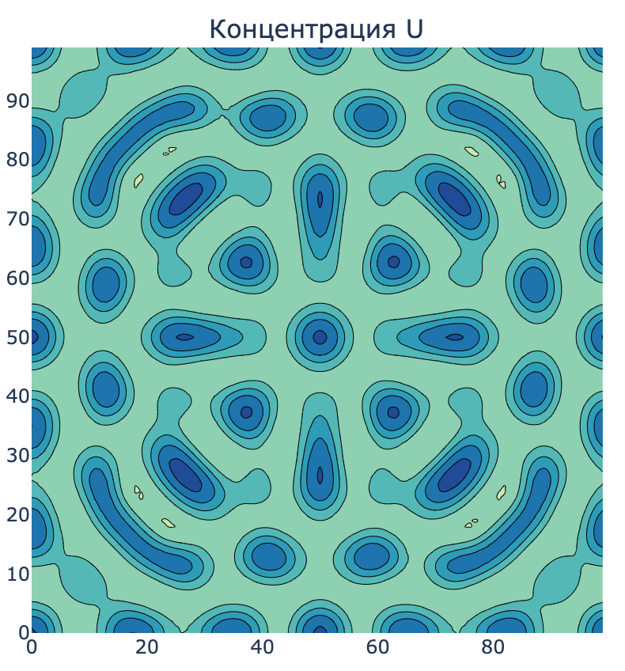
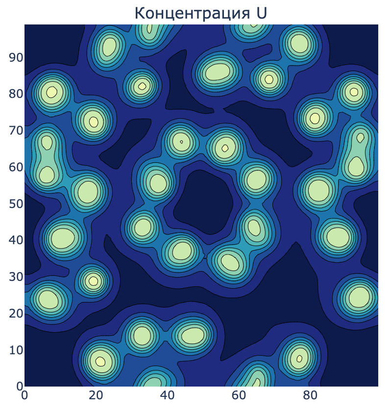

# compmathproject

## Проект по визуализации и решению реакционно-диффузионной системы Грея-Скотта

В этом проекте представлен весь необходимый функционал для численного решения и визуализации системы Грея-Скотта.

## Математическая модель

Модель описывается следующими уравнениями:
  
$$
\begin{cases}
\frac{\partial U}{\partial t} = D_u \nabla^2 U - UV^2 + F(1-U) \\
\frac{\partial V}{\partial t} = D_v \nabla^2 V + UV^2 - (F+k)V
\end{cases}
$$

где:
- $U$ и $V$ - концентрации веществ
- $D_u$ и $D_v$ - коэффициенты диффузии
- $F$ - скорость подачи $U$
- $k$ - скорость удаления $V$

Есть определенный порог значений $F$ и $k$, при которых наблюдаются узоры, и эти величины лежат в узкой полосе, имеющей форму параболы. При изменении параметров $F$ и $k$ будут соответственно разные узоры.

Решается задача с периодическими граничными условиями(на торе) и заданными начальными условиями:
$U(x, y, 0) = U_0(x, y)$\
$V(x, y, 0) = V_0(x, y)$

## Структура репозитория

```bash
.
├── README.md
├── pde_solvers_api
│   ├── __init__.py
│   ├── main.py
│   ├── schemas.py
│   ├── solvers
│   │   ├── __init__.py
│   │   ├── base.py
│   │   ├── crank_nicolson.py
│   │   ├── rk.py
│   │   └── utils.py
│   └── visualize.py
├── requirements.txt
└── run.ipynb
```

## Реализация

В проекте представлены две реализации, имеющие общий подход к пространственной дискретизации:

Для аппроксимации лапласиана использовалась пятиточечная схема методом конечных разностей, а далее использовались два подхода к решению данной системы по времени:

### 1. Метод Кранка-Николсона

Полунеявная схема Кранка-Николсона(для диффузии)/Эйлера(для нелинейной реакции).
Показывает численную стабильность при значениях шага по времени $dt$ порядка ~10.\
Выполнил Мадимаров Санджар (Б02-206)

### 2. Метод Рунге-Кутты 4-го порядка

Явная схема 4-го порядка по времени. Показывает численную стабильность при значениях $dt$ до 2.\
Выполнила Ликинова Евгения (Б02-206)

### Вывод

Полунеявный метод Кранка-Николсона для диффузии + Эйлера для реакции требует на каждом шаге решать СЛАУ, но показывает большую численную стабильность, а поэтому предпочтительнее в решении реакционно-диффузионных систем.


## Примеры визуализации

Примеры лежат в директории ```tests/```
<p float="left">
  
  
</p>
<!-- 
<p float="left">
  
  
</p> -->

## Интерактивный интерфейс

Основной файл визуализации - ```visualize.py```, использовались [ipywidgets](https://github.com/jupyter-widgets/ipywidgets) и [Plotly](https://github.com/plotly/plotly.py). Функционал:

- Регулировка параметров модели в реальном времени
- Выбор предустановленных шаблонов с разными типами паттернов
- Переключение между 2D и 3D визуализацией
- Контроль скорости симуляции и размера сетки
- Выбор численного метода

## Установка и запуск

Для начала:

```bash
pip install -r requirements.txt
```
Далее уже можно запустить API сервис, через который реализованно взаимодействие с методами, реализованными в ```solvers/```. Запустить можно, например командой:

```bash
uvicorn main:app --reload --host 0.0.0.0 --port 8000
```

## API сервера

Проект включает REST API, построенное с использованием [FastAPI](https://fastapi.tiangolo.com):

### Эндпоинты

- `POST /gray-scott/initialize`
- `POST /gray-scott/step/{method}`
- `POST /gray-scott/solve/{method}`

## Примеры использования

### Использование API напрямую

```python
import requests
import numpy as np
import matplotlib.pyplot as plt

params = {
    "Du": 0.16,
    "Dv": 0.08,
    "F": 0.035,
    "k": 0.065,
    "grid_size": 100,
    "dt": 1.0
}

response = requests.post("http://localhost:8000/gray-scott/solve/runge_kutta?steps=400", json=params)
result = response.json()

plt.figure(figsize=(12, 6))
plt.subplot(121)
plt.imshow(result["U"], cmap="viridis")
plt.colorbar()

plt.tight_layout()
plt.show()
```

### Визуализация через jupyter notebook

В Notebook выполнить:
> [!WARNING]
> **Осторожно**, визуализатор обязательно требует ```anywidget```, хоть это явно в зависимостях не отображается.
```python
from visualize import GrayScottVisualizer

URL = "http://localhost:8000"
visualizer = GrayScottVisualizer(URL)

visualizer.display()
```